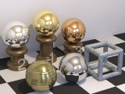

# RC3Metal

POV-Ray macros for creating metallic textures that are more realistic-looking than the metallic textures in the standard POV-Ray include files and, being argument-driven, are more flexible. The idea is to have a small number of simple tools for creating a large variety of customized textures.

Ambient and diffuse levels are automatically adjusted, and brilliance can be coordinated with specular highlights. Blurred reflection, galvanized metal, and a brushed normal are included, and common metal colors are suggested.

This project is a module from the Persistence of Vision Raytracer (POV-Ray) Object Collection.
